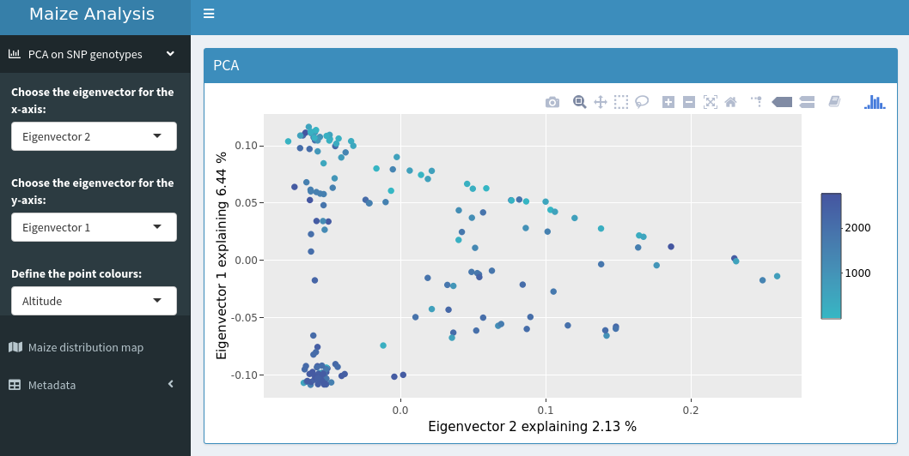
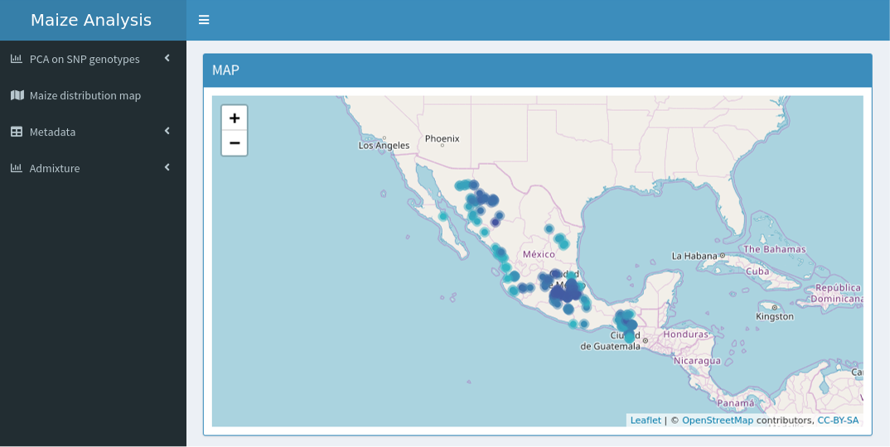
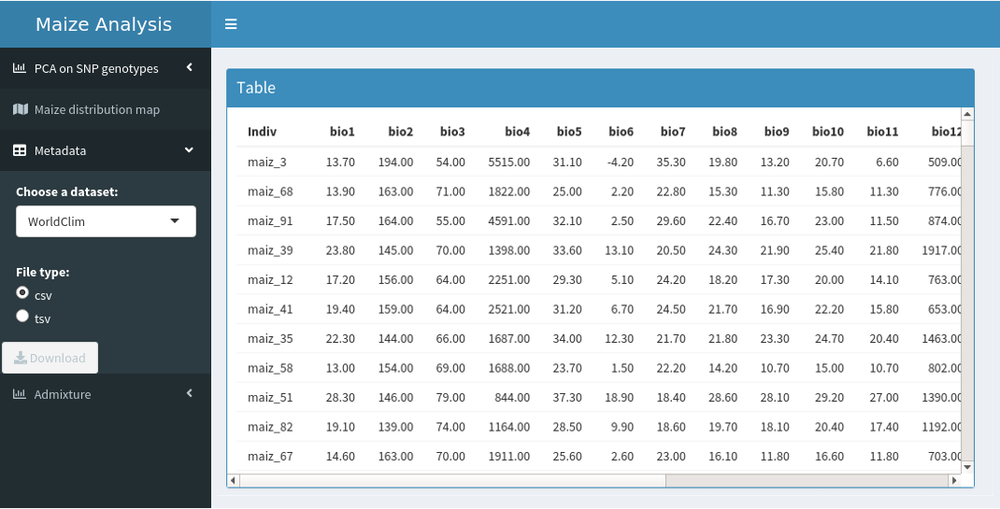

# README

## Interactive visualization using Shiny package and Arteaga maize dataset

This repository contains the development of a desktop application using Shiny. The application generates an interactive plot, map, and table for an example exploratory genomic analysis of populations with the Arteaga maize dataset.


#### Plot

- Consist of a principal component analysis (PCA) of all polymorphic SNP genotypes using `SNPRelate`. The user will be able to select some parameters to modify the plot.



#### Map

- We will be generated a distribution map and the points will be colored by the selected variable in the PCA.



#### Table

- The user will be able to download tables in different formats containing information of their interest.





#### Scripts and custom functions

###### Scripts Shiny app
- Directory `ProyectoUnidad5_CCS` contains `app.R` file which is organized as follows:

```
#### Packages used to generate the dataframes ####
library(SNPRelate)
library(dplyr)
library(raster)

## In this part, We will perform the analyzes to generate the data to use in the PCA,
## the map and the table

#### Packages used for shinydashboard ####
library(shiny)
library(shinydashboard)
library(ggplot2)
library(plotly)
library(leaflet)

## The UI part of a Shiny app built with shinydashboard has 3 basic elements
## wrapped in the dashboardPage() command.

ui <- dashboardPage(
  dashboardHeader(),  ## Dashboard header carrying the title of the dashboard
  dashboardSidebar(), ## Sidebar content of the dashboard
  dashboardBody()     ## Having defined the fluidRow() functions individually for the sake
                      ## of modularity, these are combined of them in dashbboardBody().
)

## We will create the Server part where the program and logic behind valueBoxOutput()
## and plotOutput() are added with renderValueBox() and renderPlot() respectively.
## These are enclosed inside a server function , with input and output as its parameters.

server <- function(input, output) { }

## So far, we have defined both essential parts of a Shiny app - UI and Server.
## Finally, we have to call / run the Shiny, with UI and Server as its parameters.

shinyApp(ui, server)
```
###### Input data
- Directory `ProyectoUnidad5_CCS/data` contains SNP data provided in plink and gds format.

###### Meta data
- The file `ProyectoUnidad5_CCS/meta/maizteocintle_SNP50k_meta_extended.txt` contains information about the samples maize, we mainly use latitude and longitude coordinates.
