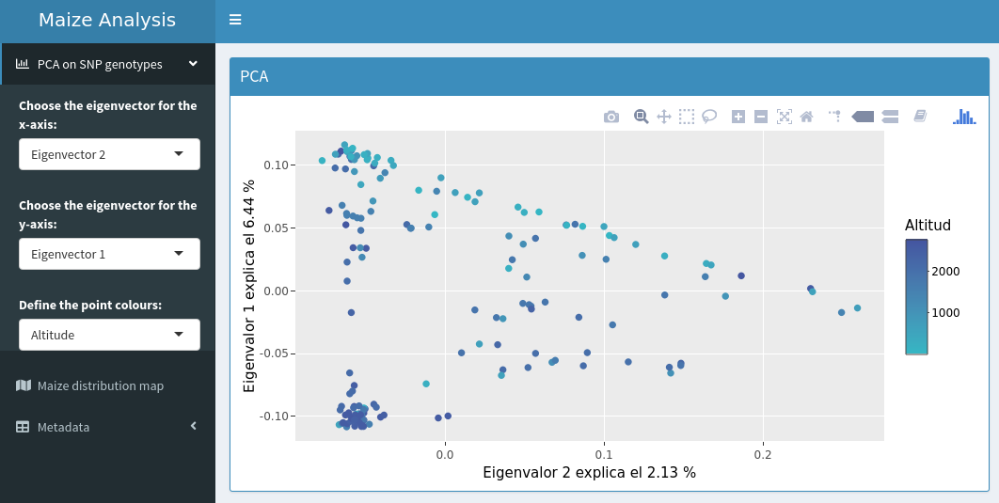
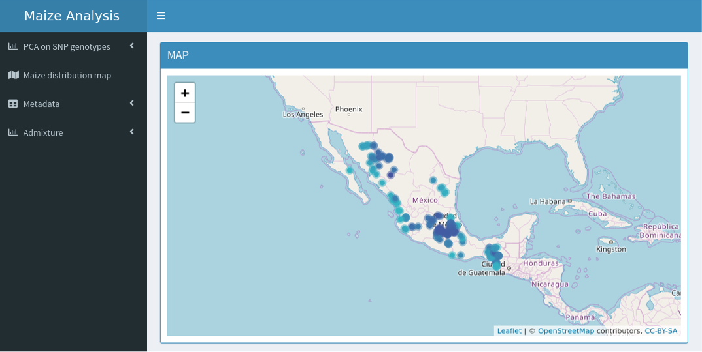
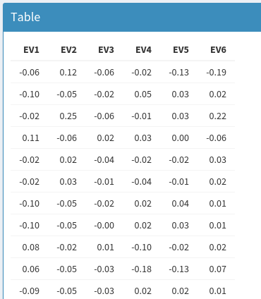
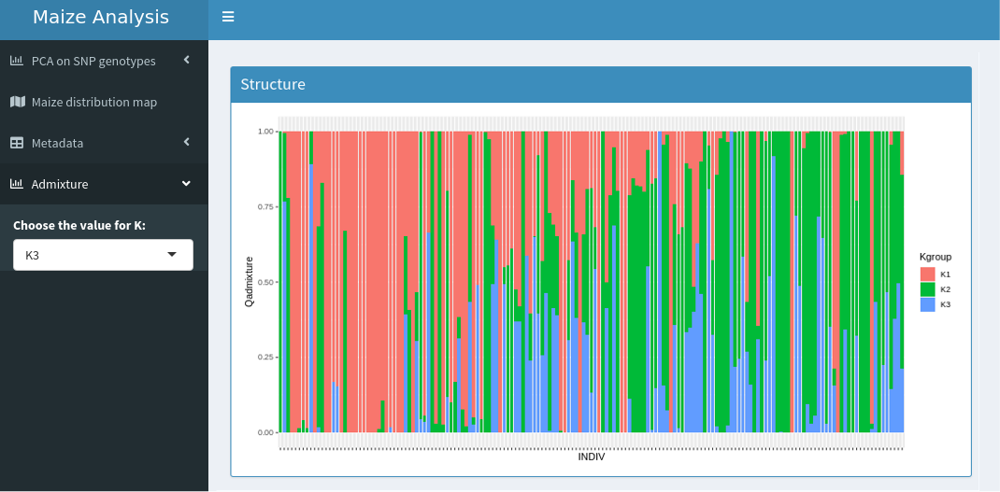

# Abstract

## Interactive visualization using Shiny package and Arteaga et al. (2016) maize dataset

Interactive documents are a new way to present the results of our research. Shiny is an R package that makes it easy to build interactive apps straight from R. This allows for greater flexibility to manipulate our plots, maps, and tables, at the time of showing them with the public. But If you want to share the document with the people, they have to have installed R and all the packages that you used. Another way to share it is to upload your app to a server like RStudio Connect, but you have to pay for service.

For this project, I worked with [Arteaga et al. (2016)](https://www.sciencedirect.com/science/article/pii/S2213596015300714?via%3Dihub) maize dataset. Data deposited in the Dryad repository: [http://dx.doi.org/10.5061/dryad.4t20n](http://dx.doi.org/10.5061/dryad.4t20n). The dataset comprises 36,931 SNPs genotyped in 46 maize landraces native to Mexico as well as the teosinte subspecies *Zea maiz* ssp. *parviglumis* and ssp. *mexicana*.  

To create an interactive application, I used the packages `shiny 1.2.0` [(Chang et al., 2018)](https://cran.r-project.org/web/packages/shiny/index.html) and `shinydashboard 0.7.1` [(Chang and Ribeiro, 2018)](https://cran.r-project.org/web/packages/shinydashboard/index.html) to make it easy to create dashboards. The goals were to generate an interactive PCA, distribution map, tables, and admixture plot.

Before to start, I created the files to use in shiny. The data of admixture was created with the script `bin/1-runadmixture.sh` using  Bash shell. The data in plink format was converted to Genomic Data Structure (GDS) data files with the package `SNPRelate 1.16.0` [(Zheng et al., 2012)](https://academic.oup.com/bioinformatics/article/28/24/3326/245844):
```
> snpgdsSummary("../data/maicesArtegaetal2015.gds")
The file name: /ProyectoUnidad5_CCS/data/maicesArtegaetal2015.gds
The total number of samples: 165
The total number of SNPs: 36931
SNP genotypes are stored in SNP-major mode (Sample X SNP).
The number of valid samples: 165
The number of biallelic unique SNPs: 30804
```
Some databases were generated and filtered using the package `dplyr 0.8.0.1` [(Wickham et al., 2019)](https://cran.r-project.org/web/packages/dplyr/index.html). The geographic coordinates of the Maize database were used to get the [WorldClime](https://www.worldclim.org/bioclim) variables using the package `raster 2.8.19` [(Hijmas, 2019)](https://cran.r-project.org/web/packages/raster/index.html).


#### PCA plot

- Consist of a principal component analysis (PCA) of all polymorphic SNP genotypes, it was performed using packages `SNPRelate`,  `ggplot2 3.1.0` [(Wickham, 2016)](https://ggplot2.tidyverse.org/) and `plotly 4.8.0`[(Sievert, 2018)](https://plotly-r.com/). The user can select the first six components to be placed on the x-axis and y-axis, also can select the type of variable (Altitude, Annual Precipitation, Annual Mean Temperature and Isothermality) to color the circle markers (Fig. 1).


Fig.1. PCA where the user can select the eigenvector for the x-axis and y-axis, also can define the point colours.

#### Maize distribution map

- The distribution map was conducted using the package `leaflet 2.0.2` [(Cheng et al., 2018)](https://cran.r-project.org/web/packages/leaflet/index.html). The points on the map are colored according to the variable used in the PCA (Fig. 2).



Fig.2. The distribution points are colored according to the selected variable in PCA.

#### Tables
- The user can download the dataframe of eigenvectors, coordinates, and WorldClim variables in format .csv and .tvs.




Fig.3. There are three options of datasets to download and two different formats.

#### Admixture plot
- The admixture plot allows choosing the number of K, the options are five. Also, the plot colors are ordained according to the variable used in the PCA.



Fig.4. By default, the admixture plot is K = 5 but you can choose 5 and order the colors according to the variable chosen in the PCA

As a final conclusion, creating a shiny application allows you to instantly modify parameters that are important, this facilitates presentations in public when you have a lot of results that can be summarized in interactive graphics. It is also a way to share results when working as a team, people can manipulate your results and make their own conclusions. I think it can be used to show results in digital journals, also in print, by adding a link to see the digital results.
