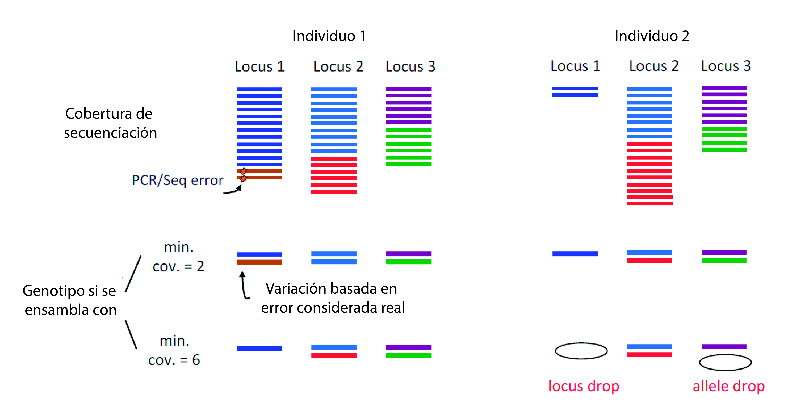
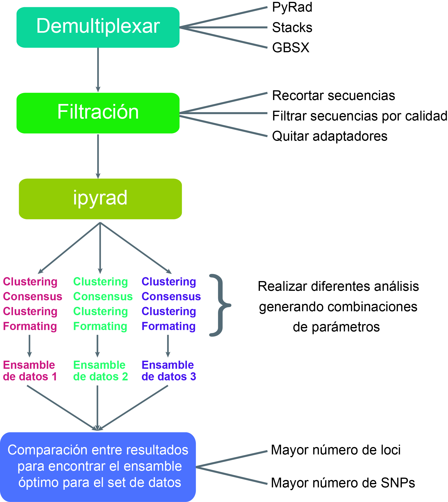

## Introducción

Las plataformas de secuenciación masiva ofrecen un gran potencial para muestrear de manera eficiente genomas completos de cualquier taxón con la intención de encontrar variación filogenéticamente informativa (Eaton & Ree, 2013). El uso de polimorfismos de un solo nucleótido (SNP) se ha ido incrementando en estudios de inferencia filogenética y han sido considerados una excelente opción en especies no modelo (Leaché and Oaks, 2017). En particular, los técnicas de representación reducida del genoma pueden ser una herramienta útil en el inferencia filogenética (Hou et al., 2015). La secuenciación de ADN “asociados a sitios de restricción” o RADseq (Miller et al., 2007), ha sido utilizada para resolver problemas tanto de introgresión (Eaton & Ree 2013) y sorteo incompleto de linajes (Streicher et al., 2014). La “genotipificación por secuenciación” o GBS (Elshire et al., 2011), es un método que ha demostrado su utilidad para resolver relaciones filogenéticas en complejos de especies (Anderson, Thiele, Krauss, & Barrett, 2017), así como para evaluar la estructura genética poblacional (Otto et al., 2017). Existen varios programas para analizar datos obtenidos mediante las técnicas de representación reducida del genoma. Stacks fue creado por Catchen et al. (2011) para la identificación y genotipado de loci en un conjunto de individuos mediante un ensamble de novo o por comparación con un genoma de referencia. Principalmente ha sido utilizado para realizar análisis de genética de poblaciones y es donde mejor se desempeña. PyRAD fue creado por Eaton (2014) con el objetivo de ensamblar loci de novo o con genoma de referencia para optimizar la cobertura a través de conjuntos de datos filogenéticos. La principal diferencia entre estos dos programas es que PyRAD utiliza un algoritmo de agrupamiento global de alineación mediante el programa USEARCH (Edgar, 2010), lo cual permite la presencia de inserciones y deleciones (indels) haciendo que se puedan comparar especies filogenéticamente distantes (Pante et al., 2015).
Cada programa tiene sus propios parámetros, pero existen algunos que son compartidos. Dentro de los parámetros más importantes se encuentra la cobertura mínima, la cual se refiere a el número de lecturas necesarias para considerar a un alelo o locus. Este parámetro nos permite distinguir entre una error de PCR/secuenciación y variación real. Si es muy bajo este valor podemos aceptar variación proveniente de un error y considerarla real, mientras si elegimos un valor alto podemos generar abandono alélico y de locus (locus drop) (Fig. 1). Si generamos “locus drop” nuestros resultados tendrán muchos datos perdidos, pero si permitimos “allele drop” estamos infiriendo homocigosis cuando el estado  real del locus es heterocigoto (Mastretta‐Yanes et al., 2015).


Figura 1. Esquema donde se muestra los efectos de utilizar una cobertura mínima baja (=2) y una alta (=6),  tomada de Mastretta‐Yanes et al. (2015).

El nivel de disimilitud de las secuencias es otro parámetro que también es importante tomar en cuenta, ya que nos permitirá poder distinguir los loci parálogos. Si elegimos un valor muy alto conlleva el riesgo de dividir los alelos divergentes en loci separados si los ortólogos difieren en una cantidad mayor que el umbral de similitud, mientras que los umbrales de similitud más bajos pueden permitir que las secuencias parálogas se fusionen incorrectamente en un lugar ortólogo (Nadukkalam Ravindran et al., 2018). Optimizar el ensamble de novo de los datos es importante para obtener buenos resultados y reducir las tasas de error (Mastretta‐Yanes et al., 2015). En estudios filogenéticos, realizar exploraciones de parámetros ha sido de utilidad para encontrar árboles con topologías altamente resueltas y fuertemente soportadas (Tripp et al., 2017).

### Método propuesto

El programa programa PyRAD fue reescrito completamente para generar un entorno rápido y flexible, también cambió el nombre por ipyrad (Eaton, 2019). El flujo de trabajo de ipyrad está basado en 7 pasos, los dos primeros corresponden a demultiplexear y a la filtración de los datos crudos (Figura 1). Aunque estos pasos se pueden realizar en ipyrad, también existen otros programas para realizar estos pasos previos. Por ejemplo, para demultiplexear Herten et al. (2015) mostraron que este programa tenia mejor rendimiento al momento de recuperar lecturas que Stacks.

* Paso 3 (Clustering).- registra el número de veces que se observa cada lectura única. Si los datos son paired-end (R1 y R2), entonces usa vsearch para combinar las lecturas paired que se superponen. Los datos resultantes se agrupan de novo, las lecturas se combinan en función de la similitud de secuencia y los grupos resultantes se alinean utilizando el algoritmo de muscle (Edgar, 2004). En este paso se aplica el filtro *clust_threshold*, este valor determina el porcentaje de similitud de secuencia que deben tener las lecturas para que se consideren lecturas en el mismo lugar. El valor por defecto es *0.85* y se pretende hacer un ensamble con diferentes valores (Tabla 1).

* En el paso 4 y 5 (Consensus).- se calcula de manera conjunta la tasa de error de secuenciación y la heterocigosidad en función de los recuentos de patrones de sitio en las lecturas agrupadas. Se utiliza un modelo diploide (es decir, se espera que se produzcan dos alelos por igual). Durante este paso, también se filtra el número máximo de sitios no determinados (*Ns*) por locus (*max_Ns_consens*). Se registra el número de alelos en cada locus y la información de profundidad de lectura también se almacena. En este paso de aplica el filtro *mindepth_statistical*, la mayoría de las estimaciones de tasas de error razonables es aproximadamente la profundidad mínima a la que se puede distinguir una llamada de base heterocigótica de un error de secuencia. El valor por defecto es *6* y se pretende hacer un ensamble con diferentes valores; sin embargo, ya que este valor no puede ser menor a 5, se utilizara *mindepth_majrule* para utilizar los valores 2 y 4 mientras se mantiene el valor por default de *mindepth_statistical* (Tabla 1).

* El paso 6 (Clustering). agrupa las secuencias de consenso en todas las muestras utilizando el mismo método de ensamblaje que en el paso 3. Se muestrea aleatoriamente un alelo antes de la agrupación, de modo que los caracteres ambiguos tienen un menor efecto en la agrupación, pero los datos resultantes retienen información para los heterocigotos. Las secuencias agrupadas se alinean entonces usando nuevamente muscle. En este paso también se utiliza el filtro *clust_threshold*.

* En el paso 7 (Formating). se aplican filtros a las alineaciones finales y se guardan los datos en varios formatos de salida (phylip, nexus, genotype y structure). En este paso se aplican varios filtros, uno de los cuales es *max_SNPs_locus* que es el número máximo de SNP permitidos en un locus final. Esto puede eliminar los efectos potenciales de alineaciones deficientes en regiones repetitivas en un conjunto de datos final al excluir loci con más de *N* snps. El valor predeterminado es 20, 20. Es probable que la configuración de valores más bajos solo sea útil para el filtrado adicional de conjuntos de datos muy desordenados. También se pretende hacer un ensamble con diferentes valores (Tabla 1).

Tabla 1.- Parámetros de ipyrad que se probaran en diferentes combinaciones.  

| Parámetro            | Paso | Valor por defecto | Valores a probar        |
|----------------------|------|-------------------|-------------------------|
| mindepth_statistical |4 y 5 |         6         | 6; 6; 8; 10             |
| mindepth_majrule     |4 y 5 |         6         | 2; 4; 8; 10             |
| clust_threshold      |3 y 6 |       0.85        | 0.82; 0.88; 0.91; 0.94  |
| max_SNPs_locus       |7     |     20 , 20       | 10, 10; 15, 15; 25, 25  |



Figura 3. Diagrama que muestra el flujo de trabajo para encontrar el ensamble óptimo.  

### Script para ejecutar ipyrad realizando combinaciones de parámetros

Script *ipyrad.sh*.- para descargar datos muestra de [ipirad](https://ipyrad.readthedocs.io/tutorial_advanced_cli.html#tutorial-advanced-cli); demultiplexear; filtrar; ejecutar ipyrad con valores predeterminados; crear los diferentes archivos con los parámetros modificados; ejecutar ipyrad con cada parámetro.

```
#!bin/bash

### get sample data simulated for ipyrad ###
curl -LkO https://github.com/dereneaton/ipyrad/raw/master/tests/ipsimdata.tar.gz
tar -xvzf ipsimdata.tar.gz
rm ipsimdata.tar.gz # remove data
mv ipsimdata data_raw # change folder name

#Create an ipyrad params defaults file
ipyrad -n default

### We use the data of pairgbs ###
# Modify the parameters of the created file
sed -i '/\[2] /c\./data_raw/pairgbs*  ## [2] ' params-default.txt
sed -i '/\[3] /c\./data_raw/pairgbs_example_barcodes.txt  ## [3] ' params-default.txt
sed -i '/\[7] /c\pairgbs  ## [7] ' params-default.txt
sed -i '/\[16] /c\2  ## [16] ' params-default.txtn  ## Remove adapters with a strict value

# Execute ipyrad with the fault parameters
ipyrad -p params-default.txt -s 1234567

#### create the set of parameters ####

# create the set of parameters for mindepth_statistical == mindepth_majrule
for i in 2 4 8 10; do
  ipyrad -p params-default.txt -b ms_$i
# Modify the parameters of the created file
sed -i '/\[0] /c\ms_'$i'  ## [0] ' params-ms_$i.txt
sed -i '/\[11] /c\'$i'  ## [11] ' params-ms_$i.txt
sed -i '/\[12] /c\'$i'  ## [12] ' params-ms_$i.txt;
done

# modify the values of mindepth_statistical = 6 when mindepth_majrule is 2 and 4
sed -i '/\[11] /c\6  ## [11] ' params-ms_2.txt;
sed -i '/\[11] /c\6  ## [11] ' params-ms_4.txt;

# create the set of parameters for clust_threshold
for i in 82 88 91 94; do
  ipyrad -p params-default.txt -b ct_$i
# Modify the parameters of the created file
sed -i '/\[0] /c\ct_'$i'  ## [0] ' params-ct_$i.txt
sed -i '/\[14] /c\0.'$i'  ## [14] ' params-ct_$i.txt;
done

# create the set of parameters for max_SNPs_locus
for i in 10 15 25; do
  ipyrad -p params-default.txt -b msnpl_$i
# Modify the parameters of the created file
sed -i '/\[0] /c\msnpl_'$i'  ## [0] ' params-msnpl_$i.txt
sed -i '/\[22] /c\'$i', '$i'  ## [22] ' params-msnpl_$i.txt;
done

### Execute the entire combination of parameters ###

files="params-ct_82.txt
params-ct_88.txt
params-ct_91.txt
params-ct_94.txt
params-ms_10.txt
params-ms_2.txt
params-ms_4.txt
params-ms_8.txt
params-msnpl_10.txt
params-msnpl_15.txt
params-msnpl_25.txt"

for k in $files; do
# Demultiplex the raw data files
ipyrad -p ${k} -s 34567 -f;
done
```
### Discusión
De acuerdo con Mastretta‐Yanes et al. (2015) uno de los parámetro mas sensibles es la cobertura mínima, pero también el nivel de disimilitud de las secuencias puede ser un factor a tomar en cuenta para las regiones parálogas (Nadukkalam Ravindran et al., 2018). Por lo tanto, el protocolo sugerido en este trabajo toma ambas sugerencias. También el número máximo de SNP permitidos en un locus ha sido modificado en algunos análisis (Federman et al., 2018). En este protocolo se hicieron las modificaciones a los tres parámetros antes mencionados, se realizo un script para probar las modificaciones con datos generados por Eaton (2019). El script corre perfectamente y genera los archivos para cada parámetro modificado; sin embargo, aun falta realizar el script para analizar y comprara los diferentes ensambles. De acuerdo con varios artículos uno de los resultados a comparar es el número de loci y SNPs recuperados por cada ensamble, por lo cual sera el siguiente script a desarrollar.

### Literatura

Literatura
Catchen, J. M., Amores, A., Hohenlohe, P., Cresko, W., & Postlethwait, J. H. (2011). Stacks: Building and Genotyping Loci De Novo From Short-Read Sequences. G3: Genes, Genomes, Genetics, 1(3), 171-182. https://doi.org/10.1534/g3.111.000240

Eaton, D. A. R. (2014). PyRAD: assembly of de novo RADseq loci for phylogenetic analyses. Bioinformatics, 30(13), 1844-1849. https://doi.org/10.1093/bioinformatics/btu121

Eaton, D. A. R. (2019). ipyrad. Recuperado 21 de mayo de 2019, de https://ipyrad.readthedocs.io/files.html

Eaton, D. A. R., & Ree, R. H. (2013). Inferring Phylogeny and Introgression using RADseq Data: An Example from Flowering Plants (Pedicularis: Orobanchaceae). Systematic Biology, 62(5), 689-706. https://doi.org/10.1093/sysbio/syt032

Edgar, R. C. (2004). MUSCLE: multiple sequence alignment with high accuracy and high throughput. Nucleic Acids Research, 32(5), 1792-1797.

Edgar, Robert C. (2010). Search and clustering orders of magnitude faster than BLAST. Bioinformatics (Oxford, England), 26(19), 2460-2461. https://doi.org/10.1093/bioinformatics/btq461

Federman, S., Donoghue, M. J., Daly, D. C., & Eaton, D. A. R. (2018). Reconciling species diversity in a tropical plant clade (Canarium, Burseraceae). PLOS ONE, 13(6), e0198882. https://doi.org/10.1371/journal.pone.0198882

Goetze, M., Zanella, C. M., Palma‐Silva, C., Büttow, M. V., & Bered, F. (2017). Incomplete lineage sorting and hybridization in the evolutionary history of closely related, endemic yellow-flowered Aechmea species of subgenus Ortgiesia (Bromeliaceae). American Journal of Botany, 104(7), 1073-1087. https://doi.org/10.3732/ajb.1700103

Herten, K., S Hestand, M., R Vermeesch, J., & Van Houdt, J. (2015). GBSX: A toolkit for experimental design and demultiplexing genotyping by sequencing experiments. BMC Bioinformatics, 16. https://doi.org/10.1186/s12859-015-0514-3

Li, Q.-Q., Zhou, S.-D., Huang, D.-Q., He, X.-J., & Wei, X.-Q. (2016). Molecular phylogeny, divergence time estimates and historical biogeography within one of the world’s largest monocot genera. AoB PLANTS, 8. https://doi.org/10.1093/aobpla/plw041

Mastretta‐Yanes, A., Arrigo, N., Alvarez, N., Jorgensen, T. H., Piñero, D., & Emerson, B. C. (2015). Restriction site-associated DNA sequencing, genotyping error estimation and de novo assembly optimization for population genetic inference. Molecular Ecology Resources, 15(1), 28-41. https://doi.org/10.1111/1755-0998.12291

Nadukkalam Ravindran, P., Bentzen, P., Bradbury, I. R., & Beiko, R. G. (2018). PMERGE: Computational filtering of paralogous sequences from RAD‐seq data. Ecology and Evolution, 8(14), 7002-7013. https://doi.org/10.1002/ece3.4219

Pante, E., Abdelkrim, J., Viricel, A., Gey, D., France, S. C., Boisselier, M. C., & Samadi, S. (2015). Use of RAD sequencing for delimiting species. Heredity, 114(5), 450-459. https://doi.org/10.1038/hdy.2014.105

Tripp, E. A., Tsai, Y.-H. E., Zhuang, Y., & Dexter, K. G. (2017). RADseq dataset with 90% missing data fully resolves recent radiation of Petalidium (Acanthaceae) in the ultra-arid deserts of Namibia. Ecology and Evolution, 7(19), 7920-7936. https://doi.org/10.1002/ece3.327
